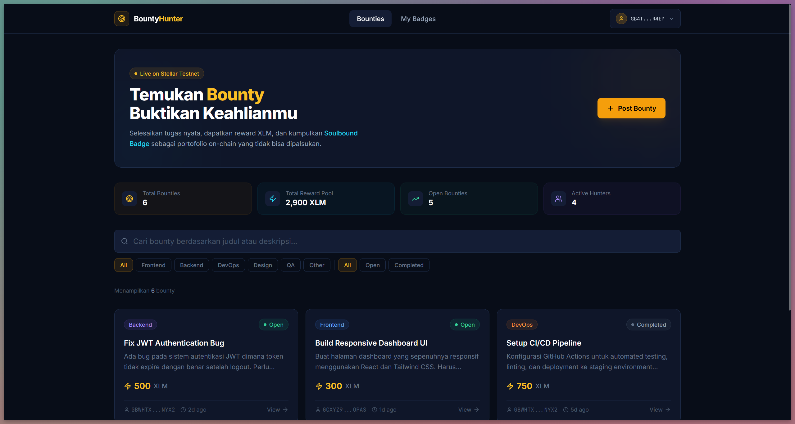
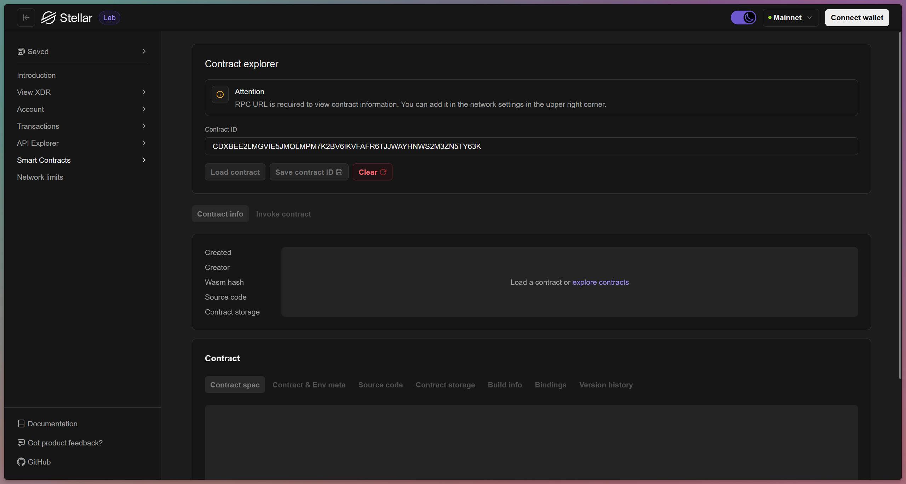
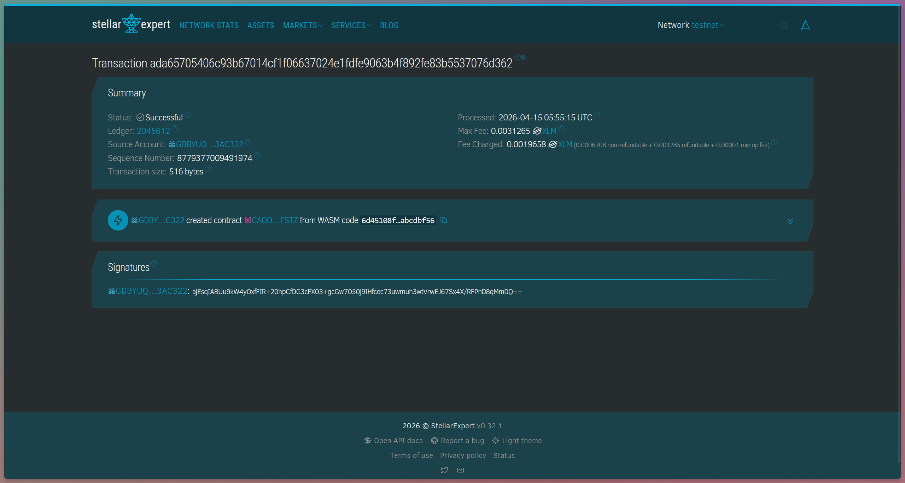

# Bounty Hunter

**Bounty Hunter** — Decentralized Micro-Bounty & Digital Reputation Platform on Stellar

---

## Overview

Bounty Hunter is a decentralized micro-task marketplace built on the **Stellar blockchain** using the **Soroban smart contract SDK**. It connects **Issuers** (task creators) with **Solvers** (developers) through a transparent, trustless bounty system backed by on-chain escrow.

Every completed task generates a **Soulbound Badge** — a permanent, non-transferable digital certificate that is permanently bound to the developer's wallet identity. Think of it as a *"Decentralized LinkedIn"*: the more bounties a developer completes, the stronger their verifiable on-chain reputation becomes.

---

## Screenshot



---

## The Problem & Solution

| Problem | Bounty Hunter's Solution |
| :--- | :--- |
| **Payment Risk** — Developers hesitate to take on small tasks fearing non-payment | **Escrow System** — Reward funds are locked in the contract upfront, guaranteeing availability |
| **Unverifiable Portfolio** — Hard to prove real contributions on small projects in a traditional CV | **Soulbound Badge** — A permanent on-chain certificate that cannot be faked or transferred |
| **Slow Bureaucracy** — Hiring for a simple bug fix takes too long | **Open Access** — Anyone can contribute directly without lengthy interview processes |

---

## Key Features

### A. Bounty Management
- **Post a Task** — Issuers create a bounty with a title, description, category, and reward amount
- **Automatic Escrow** — Reward funds are locked in the contract the moment a bounty is published
- **Browse Bounties** — Solvers can explore all available bounties, filtered by category and status

### B. Submission & Verification
- **Submit Proof of Work** — Solvers submit a repository link or technical documentation as proof
- **Review & Approve** — The Issuer reviews the work and approves it directly on-chain

### C. Reputation System (Soulbound Badge)
- **Auto-Minted** — A badge is issued instantly to the Solver's wallet upon approval
- **Permanent Identity** — Badges are bound to the wallet address and cannot be sold or transferred
- **On-Chain Portfolio** — A developer's badge collection becomes a transparent, tamper-proof track record

---

## User Flow

```
1. Issuer  →  create_bounty()        Post a task + lock reward funds (escrow)
2. Solver  →  get_bounties()         Browse the list of available bounties
3. Solver  →  submit_work()          Submit proof of work (repo URL / documentation)
4. Issuer  →  approve_submission()   Review and approve the submission
                    ↓
5. System  →  [automatic] Release reward to the Solver's wallet
              [automatic] Mint a Soulbound Badge to the Solver's wallet
```

---

## Smart Contract

### Testnet Deployment

| Network | Contract ID |
| :--- | :--- |
| Stellar Testnet | `CAOORSN3XLOHAOBT3KF6GKZR4L6P3HLKDV5F2SAZ5KLNNYQUD2XVFSTZ` |

You can inspect the contract on [Stellar Expert (Testnet)](https://lab.stellar.org/smart-contracts/contract-explorer?$=network$id=testnet&label=Testnet&horizonUrl=https:////horizon-testnet.stellar.org&rpcUrl=https:////soroban-testnet.stellar.org&passphrase=Test%20SDF%20Network%20/;%20September%202015;&smartContracts$explorer$contractId=CAOORSN3XLOHAOBT3KF6GKZR4L6P3HLKDV5F2SAZ5KLNNYQUD2XVFSTZ;;).

### Contract Functions

| Function | Parameters | Description |
| :--- | :--- | :--- |
| `create_bounty` | `issuer, title, description, category, reward` | Create a new bounty and lock the reward in escrow |
| `get_bounties` | — | Retrieve all registered bounties |
| `get_bounty` | `id` | Retrieve a single bounty by ID |
| `submit_work` | `solver, bounty_id, proof_url` | Submit proof of work for a bounty |
| `get_submission` | `bounty_id` | Get the current submission for a bounty |
| `approve_submission` | `issuer, bounty_id` | Approve a submission → release reward + mint badge |
| `get_badges` | `owner` | Get all Soulbound Badges owned by a developer |

---

## Data Structures

### `Bounty`
```rust
pub struct Bounty {
    pub id: u64,
    pub title: String,
    pub description: String,
    pub category: String,       // e.g. "Frontend", "Backend", "DevOps"
    pub reward: i128,           // in stroops (smallest Stellar unit)
    pub issuer: Address,
    pub status: BountyStatus,   // Open | Completed
}
```

### `Submission`
```rust
pub struct Submission {
    pub bounty_id: u64,
    pub solver: Address,
    pub proof_url: String,      // link to repo / documentation / live demo
}
```

### `Badge` *(Soulbound)*
```rust
pub struct Badge {
    pub id: u64,
    pub bounty_id: u64,
    pub title: String,
    pub category: String,
    pub issued_at: u64,         // ledger timestamp
}
```

---

## Getting Started

### Prerequisites

- [Rust](https://www.rust-lang.org/tools/install) & Cargo
- [Stellar CLI](https://developers.stellar.org/docs/tools/developer-tools/stellar-cli)
- [Node.js](https://nodejs.org/) v18+ (for the frontend)
- [Freighter Wallet](https://freighter.app) browser extension

### Build the Contract

```bash
cd contracts/bounty-hunter
stellar contract build
```

### Run Tests

```bash
cargo test
```

### Deploy to Testnet

```bash
# Generate and fund a deployer keypair
stellar keys generate deployer --network testnet
stellar keys fund deployer --network testnet

# Deploy — note the contract ID printed in the output
stellar contract deploy \
  --wasm target/wasm32v1-none/release/bounty_hunter.wasm \
  --source deployer \
  --network testnet
```

### Run the Frontend

```bash
cd frontend
npm install
npm run dev
```

Open [http://localhost:5173](http://localhost:5173) in your browser. Connect your Freighter wallet set to **Stellar Testnet** to interact with the platform.

---

## Project Structure

```
stellar-workshop-starter/
├── contracts/
│   └── bounty-hunter/
│       ├── Cargo.toml
│       ├── Makefile
│       └── src/
│           ├── lib.rs       # Contract logic
│           └── test.rs      # Unit tests
├── frontend/
│   ├── src/
│   │   ├── components/      # Header, BountyCard, Modals
│   │   ├── context/         # AppContext (global state)
│   │   ├── pages/           # Dashboard, BountyDetail, Profile
│   │   └── stellar/         # Freighter wallet integration
│   ├── package.json
│   └── vite.config.js
├── PRD.md                   # Product Requirements Document
├── Cargo.toml
└── README.md
```

---

## Tech Stack

| Layer | Technology |
| :--- | :--- |
| Smart Contract | Rust · Soroban SDK `v25` · `wasm32v1-none` |
| Blockchain | Stellar Network (Testnet) |
| Frontend | React 18 · Vite · Tailwind CSS |
| Wallet | Freighter (`@stellar/freighter-api`) |

---

## Strategic Value

The more bounties a developer completes on Bounty Hunter, the stronger their credibility becomes — because every achievement is backed by **real, verifiable proof of work** permanently recorded on the Stellar blockchain. It cannot be fabricated, it cannot be deleted.

---

**Bounty Hunter** — Prove Your Skills Through Real Work on the Blockchain
